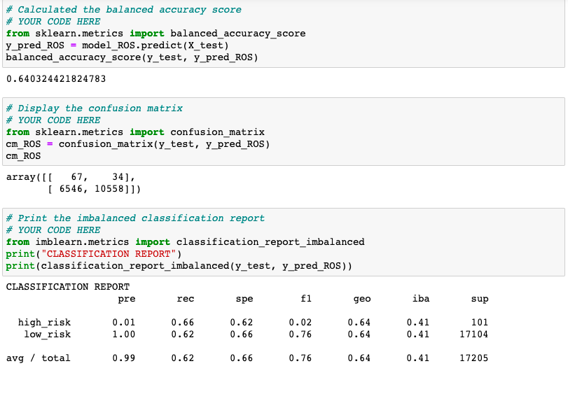
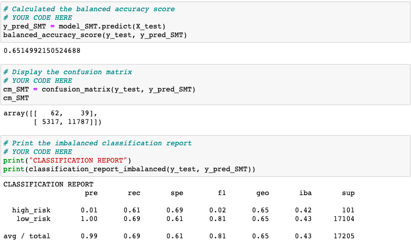
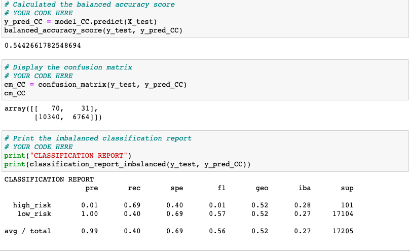
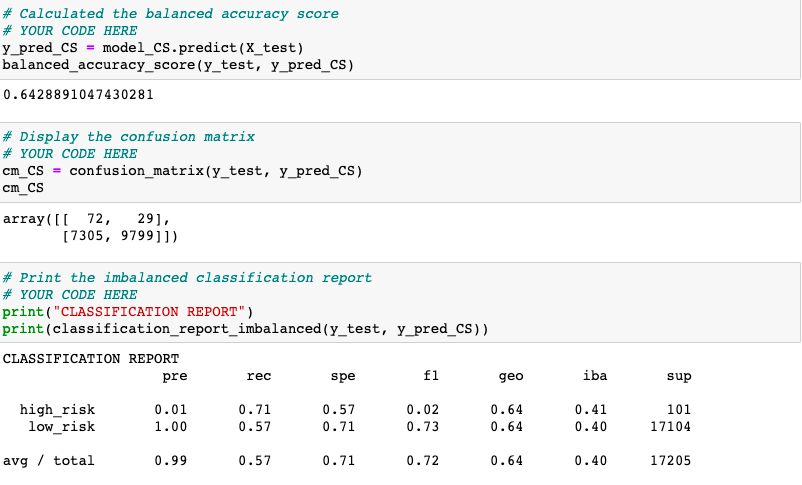
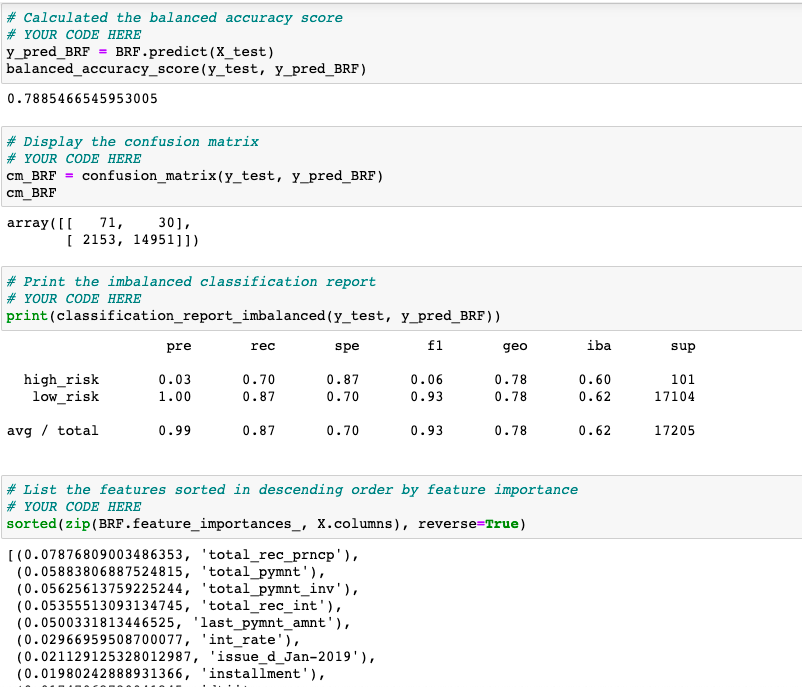
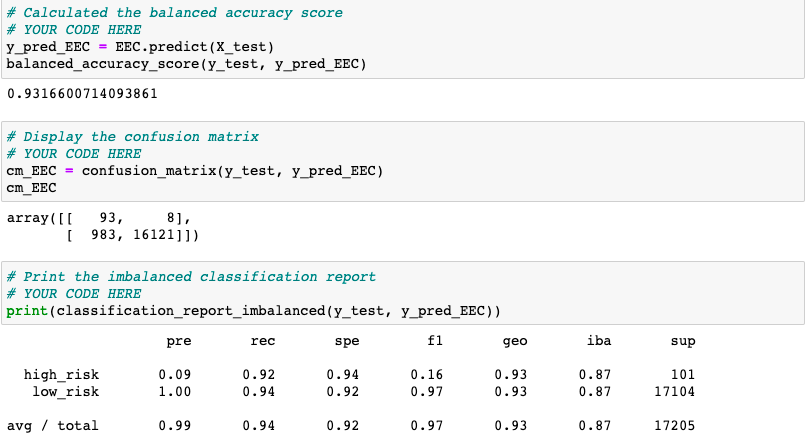

# Credit_Risk_Analysis

## Objective
I applied supervised machine learning to analyze credit card risk. Supervised machine learning was used because the data provided is labeled and I wanted to predict the output.  Credit risk is an unbalanced classification problem due to good loans outnumbering the bad.  Imbalanced classification is caused by an unequal distribution of classes in the dataset.  Therefore, I used several techniques (below) to train and evaluate the models using resampling.

### Random Oversampling
Instances of the minority class (high_risk) are randomly selected and added to the training set until the majority (low_risk) and minority classess are balanced.  The RandomOverSampler algorithm was used for evaluation.

### Synthetic Minority Oversampling Technique (SMOTE)
This is another oversampling approach.  However, unlike the RandomOverSampler algorithm, new values are created using neighboring instances in the minority class.  This technique is vulnerable to outliers and doesn't always outperform random oversampling.

### Cluster Centroids Algorithm
This algorithm generates synthetic centroids or data points after identifying the clusters of the majority class.  This method reduces data from the majority class until it is down to the size of the minority class.

### SMOTEENN
This method combines the SMOTE and Edited Nearest Neighbors (ENN) algorithms.  The minority class is oversampled using SMOTE and undersampling is used to clean the results.  The nearest neighbors whose data points belong to different classes are dropped.  

### Balanced Random Forest Classifier
This is an ensemble method that randomly undersamples each bootstrap sample to balance it.

### Easy Ensemble Classifier
This is another ensemble classifier.  An ensemble of AdaBooset learners are trained on different balanced bootstrap samples. 

### Tasks
- Use Resampling Models to Predict Credit Risk
- Use the SMOTEENN Algorithm to Predict Credit Risk
- Use Ensemble Classifiers to Predict Credit Risk

## Resources

### Tools/Languages
- imbalanced-learn 0.9.0
- sckit-learn 1.0.2
- jupyter notebook 6.4.5
- pandas
- python

### Data
- LendingClub(credit card dataset 2019 csv)

## Results

### Resampling Models to Predict Credit Risk
#### Oversampling 

##### RandomOverSampler Algorithm

##### SMOTE Algorithm

#### Undersampling

##### ClusterCentroids Algorithm

### Use the SMOTEENN Algorithm to Predict Credit Risk

### Use Ensemble Classifiers to Predict Credit Risk

#### BalancedRandomForestClassifier Algorithm

#### EasyEnsembleClassifier Algorithm

## Summary 
- For high risk loans, the F1 Score for most of the algorithms are very close to 0.  A good F1 Score should be close to 1.  The scores in the results range from (0.01 - 0.16).  The EasyEnsembleClassifier had the best score (0.16) and the undersampling algorithm (ClusterCentroids) had the worst score (0.01).

- The precison for high risk loans didn't fair any better.  The the results range from (0.01 - 0.09). The EasyEnsembleClassifier had the best score (0.09) and multiple algorithms (ClusterCentroids, RandomOverSampler, SMOTE, SMOTEENN) all had the worst scores (0.01). 

- The recall or sensitivity for high risk loans yielded better results.  The EasyEnsembleClassifier had the highest score (0.92) and SMOTE had the worst (0.61).

- Based on these results, I believe the EasyEnsembleClassifier would be the best model to use for low and high risk loans.  The accuracy score is around 93% and the recall for both low and high risk loans are over 90%.

